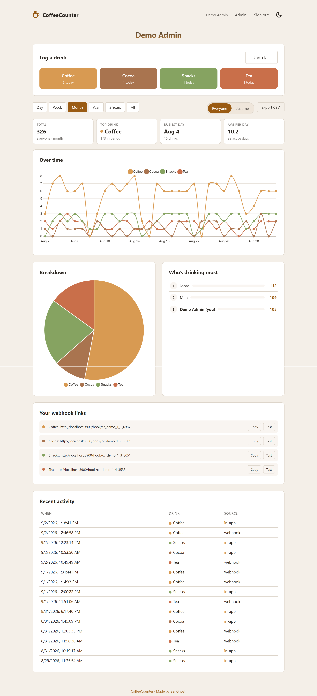
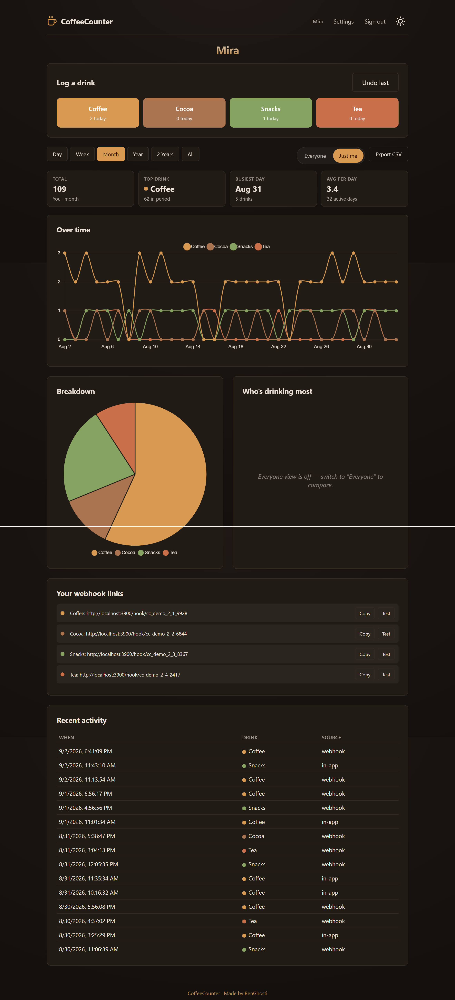

# ☕ CoffeeCounter

Self-hosted, multi-user webapp for tracking drink/consumption stats via
personal webhook links. Single Docker container, SQLite storage, Chart.js
dashboards. Built for Unraid.

<p align="center">
    
    
</p>
<p align="center"><em>Dashboard in light and dark theme</em></p>

## Stack

- **Backend**: FastAPI (Python) + SQLite (stdlib `sqlite3`, no ORM)
- **Frontend**: static HTML/CSS/JS, Chart.js vendored locally — served by
  the same container as the API (no separate frontend container/reverse
  proxy, no CDN needed)
- **Auth**: PIN-only login (no username field — the PIN itself identifies
  the user) and/or Passkey/WebAuthn with discoverable credentials, so
  passkey sign-in also needs no username. Set via `COFFEECOUNTER_AUTH_MODE`.

## Demo mode (try it without setting anything up)

On Windows, double-click `demo.bat` (or run it from a terminal). It runs
CoffeeCounter directly as a local Python server — no Docker needed — on an
isolated port (`3900`) with its own data folder (`.\demo-data`), separate
from any real deployment, so it can't collide with a production instance.
The Python venv is created under `%LOCALAPPDATA%\CoffeeCounter` (deliberately
*not* in the repo folder, so pip/Python stay fast even when the project
lives on a slow network share). It seeds 3 demo users and ~2.5 years of
spread-out events so every range switch (Day/Week/Month/Year/2 Years/All)
actually has something to show.

```
demo.bat            start + seed (safe to re-run — won't reseed over
                     existing data)
demo.bat reset       wipe .\demo-data, start completely fresh
demo.bat <port>      run on another port (default 3900)
```

Requirements: Python 3.10+ on PATH (the script falls back to `py -3`).
Stop with `Ctrl+C` — the data stays on disk for the next run.

Demo logins (also printed by the script):

| Role  | Name       | PIN  |
|-------|------------|------|
| Admin | Demo Admin | 1111 |
| User  | Mira       | 2222 |
| User  | Jonas      | 3333 |

On Linux/macOS/Unraid, the same seeding works directly against any
CoffeeCounter database: run `python scripts/seed_demo.py` locally against a
dev DB, or once the real container is up:
`docker exec coffeecounter python scripts/seed_demo.py`. Add `--force` to
wipe and reseed an already-populated database.

## Quick start (real deployment)

1. Copy `.env.example` to `.env` and adjust `BASE_URL`, `APP_DATA_PATH`,
   `TRUSTED_PROXY_IPS` for your setup.
2. `docker compose up -d --build`
3. Open `BASE_URL` in a browser. First run redirects to `/setup.html` —
   create your name + PIN there. **This account automatically becomes
   admin.** There is no public sign-up after that; every further user is
   created by the admin from the Admin panel (name + PIN, no email needed).
4. From the Admin panel: add users, add/rename drink types and pick their
   chart color, reset PINs, manage your own passkeys.
5. From the Dashboard: each user's webhook links (one per active drink
   type) are auto-provisioned on first visit — copy them into a browser
   bookmarklet, iOS Shortcut, ESP32 button, `curl`, Home Assistant, etc.
   `GET` or `POST` both work; a trigger always just does `+1`.

## Reverse proxy / Cloudflare

You said the reverse proxy already runs as its own container in front of
this one, with Cloudflare on top. CoffeeCounter is built to sit behind
that:

- `TRUST_PROXY=true` makes it read `CF-Connecting-IP` first (falls back to
  `X-Forwarded-For`) instead of the proxy container's own IP — this is
  what the PIN-login rate limiter and event logging use as "the real
  client IP".
- Optionally set `TRUSTED_PROXY_IPS` to your reverse-proxy container's IP
  so forwarded headers are only honored from a connection you trust.
- Passkeys require HTTPS with a real hostname (or `localhost`) — make sure
  `BASE_URL` and `COFFEECOUNTER_RP_ID` (if you set it explicitly) match
  the hostname your users actually see in the browser, not the internal
  Docker/Unraid address.

## Data model

`users` (PIN hash, role) · `passkeys` · `drink_types` (name, color,
active) · `webhook_tokens` (per user + drink type) · `events` (one row per
trigger, timestamped) · `daily_stats` (per user/drink/day counters, kept in
sync by SQLite triggers on `events`) · `webauthn_challenges` (short-lived).

Aggregation for Week/Month/Year/2 Years/All reads the `daily_stats`
pre-aggregation table instead of rescanning every event, so even large
histories stay fast. The `Day` view is hourly and reads raw `events`
directly. On databases created before `daily_stats` existed, the table is
backfilled once automatically at startup (see `app/routers/stats.py`).

## What's intentionally not included

- No Docker healthcheck (per the concept doc).
- No separate reverse-proxy container in `docker-compose.yml`, since yours
  already exists — just point it at `coffeecounter:3000` (or the mapped
  host port) on your Docker network.

## Project structure

```
coffeecounter/
  app/                  FastAPI backend
    routers/             auth, users, drinks, webhooks, events, stats, export
    main.py               app wiring + serves frontend/
    config.py              env settings
    database.py             SQLite schema + migrations
    security.py               PIN hashing, sessions, real-IP, rate limiting
    webauthn_utils.py          passkey registration/authentication
  frontend/              static HTML/CSS/JS (login, setup, dashboard, admin)
  Dockerfile
  docker-compose.yml
  .env.example
```
